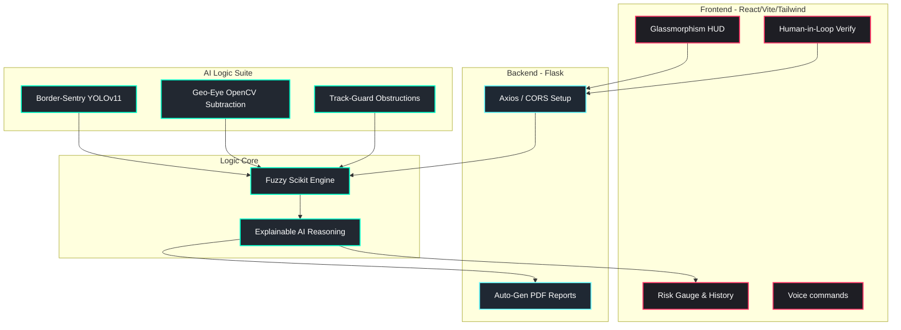

# Trinetra Rakshak (Software-Defined Defense)

Trinetra Rakshak is a high-end "Digital Shield" designed to replace traditional hardware with AI intelligence. This system provides real-time threat detection, reasoning, and visual tracking with an explainable AI (XAI) core.

## 🌟 Mission Profile

As a sole developer, this project serves as a comprehensive Command Center employing cutting-edge Computer Vision (YOLOv11), Fuzzy Logic Reasoning, and a Dynamic React-based "Glassmorphism" HUD dashboard.

## 🏗️ Architecture Design

## 🚀 Repositories & Modules

*   **/backend**: Core Flask REST APIs, Axios integrations, and PDF reporting.
*   **/frontend**: Elite command center utilizing Vite, React, Framer Motion, and Tailwind CSS.
*   **/ai_logic**:
    *   **Border-Sentry**: YOLOv11 Dynamic ROI Intrusion engine.
    *   **Geo-Eye**: Time-lapsed terrain anomaly detection.
    *   **Track-Guard**: Railway optimization & track blockade AI.
    *   **Reasoning Engine**: Scikit-Fuzzy module processing combined variable sets (Velocity, Proximity, Weather).

## 🧰 Tech Stack
-   **Frontend**: React, Vite, Tailwind CSS, Recharts, Framer Motion.
-   **Backend**: Python, Flask, Flask-CORS.
-   **AI & Logic**: Scikit-Fuzzy, OpenCV, Python.
-   **DevOps**: Docker, Github Actions.