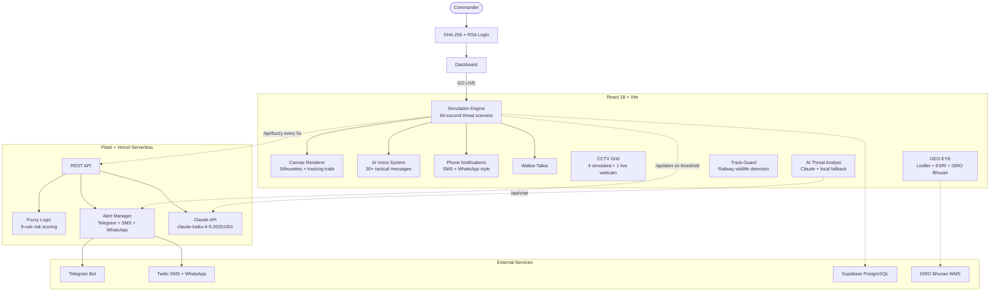

# TRINETRA RAKSHAK

### त्रिनेत्र रक्षक -- "Three-Eyed Guardian"

### AI-Powered Integrated Command & Control Surveillance System

**A defense-grade AI surveillance prototype for India's defense infrastructure -- featuring border security, railway safety, and integrated GIS mining detection with real multi-channel alert dispatch.**

[**Launch Command Center**](https://trinetra-rakshak-ssd.vercel.app) | [**Open DB Viewer**](https://backend-ten-fawn-25.vercel.app/admin/db) | [**Manual**](#how-it-works)

---

## What is Trinetra Rakshak?

**Trinetra Rakshak** (त्रिनेत्र रक्षक -- *"Three-Eyed Guardian"*) is a real-world analogy-based prototype that demonstrates how AI can enhance India's defense infrastructure. The **3 eyes** represent:

1. **Border-Sentry** -- AI-powered perimeter intrusion detection with fuzzy logic risk scoring
2. **GEO-EYE** -- Satellite GIS terrain analysis for illegal mining detection in Jharkhand
3. **Track-Guard** -- Railway wildlife/obstruction detection with auto-brake signals

> Modeled after real programs: BSF's **BOLD-QIT**, Indian Railways' **Project Nilgiri**, and ISRO's **Mining Surveillance System (MSS)**.

---

## Core Modules

| Module | What it does | Real-world analogy |
|--------|-------------|-------------------|
| **Dashboard** | Command overview with status cards, module navigation, and GO LIVE button | Military situational briefing screen |
| **Telemetry** | Live real-time system health metrics (Signal, Latency, AI Confidence, Uptime) | Tactical sensor node health uplinks |
| **Live Feed** | 60-second border intrusion simulation with canvas-based tactical bounding boxes on real video | BSF CCTV monitoring at border posts |
| **CCTV Grid** | 5-camera grid with different video feeds, AI bounding boxes, wanted profiling, and live webcam (CAM-05) | Multi-camera surveillance rooms |
| **GEO-EYE** | Satellite map (React-Leaflet + ESRI + ISRO Bhuvan WMS toggle) with terrain change detection scan | ISRO/NRSC Mining Surveillance System |
| **Track-Guard** | Railway wildlife detection with auto-brake and time-to-impact calculation | Project Nilgiri elephant detection |
| **Analytics** | Real-time threat charts, KPIs, and trend analysis | Military intelligence dashboards |

---

## How It Works

### 1. Authentication & Login
The system uses **SHA-256 password hashing** with salt via the Web Crypto API and generates **RSA-2048 key pairs** during authentication. Sessions are managed with sessionStorage. Login with Officer credentials to access the Command Center.

### 2. Simulation Engine
Clicking **GO LIVE** starts a 60-second border intrusion scenario:
- **0-15s**: Patrol phase -- cameras scanning, all sectors clear
- **15-35s**: Detection phase -- AI identifies targets with increasing confidence
- **35-50s**: Escalation phase -- CRITICAL threat confirmed, all alert channels fire
- **50-60s**: Resolution phase -- threat neutralized, sector returns to green

During live simulation, the frontend polls the **real Flask backend** every 5 seconds to get fuzzy logic risk scores. The backend runs a 9-rule fuzzy inference system (velocity x proximity x visibility --> risk_score) and returns both the score and XAI reasoning text.

### 3. Detection & Rendering
The canvas renderer draws **military-grade tactical overlays** on real video feeds:
- Realistic human silhouettes with walking animation (not stick figures)
- Vehicle and drone shape recognition with appropriate silhouettes
- Corner-bracket bounding boxes with risk-colored glow halos
- Motion tracking trails showing target movement history
- Distance readouts, motion vectors with velocity (km/h)
- Weapon indicators with pulsing danger markers for high-risk hostiles
- Grid overlay, coordinate readout, and scan line effects

### 4. Multi-Channel Alert Dispatch
When the fuzzy risk score crosses thresholds, real alerts fire:
- **Score > 50 (WARNING)**: Telegram Bot API sends alert to the configured chat
- **Score > 75 (CRITICAL)**: Telegram + Twilio SMS + Twilio WhatsApp all fire simultaneously
- The frontend also shows WhatsApp-style and SMS-style phone notifications with delivery receipts (Sent -> Delivered -> Read)
- An **Incident Report** can be generated on-demand with full threat summary, response actions, and AI analysis

### 5. AI Threat Analyst (Claude-Powered)
The AI chatbot panel uses **Anthropic's Claude API** (claude-haiku-4-5-20251001) with a defense-focused system prompt. It receives the current threat score and active module as context, enabling it to give tactical advice. If the API is unavailable, it falls back to a local keyword-matching engine.

### 6. CCTV Grid (5 Cameras)
Each camera has a **different real video feed** with unique detection scenarios:
- **CAM-01**: Main gate -- vehicle approach and personnel identification
- **CAM-02**: Perimeter North -- multi-intruder breach attempt with combatant detection
- **CAM-03**: East watchtower -- wildlife classification and UAV drone detection
- **CAM-04**: Command bunker -- secure zone with no movement
- **CAM-05**: Live webcam -- real camera feed via getUserMedia with AI scan overlay

When a BREACH is detected, the system shows a **WANTED face capture** snapshot, triggers the walkie-talkie, fires SMS alerts, and dispatches the QRF.

### 7. GEO-EYE (Satellite Intelligence)
Uses React-Leaflet with **ESRI World Imagery** satellite tiles. A toggle button switches to **ISRO Bhuvan WMS overlay** (Government of India satellite data). Running a GEO scan simulates terrain change detection in the Jharkhand mining corridor, marking suspected illegal mining sites with risk circles.

### 8. Track-Guard (Railway Safety)
Monitors a railway corridor for wildlife and obstructions. When an animal is detected:
- Calculates **time-to-impact** based on train speed and distance
- Sends **auto-brake signal** to Indian Railways API
- Triggers AI voice alerts with species classification
- Logs the event to the database

### 9. Persistent Logging (Supabase)
All CRITICAL and WARNING events are logged to a **Supabase PostgreSQL database** with module name, risk score, and details. This creates a persistent audit trail of all threat events.

### 10. Communication Systems
- **Walkie-Talkie**: Push-to-talk radio with auto-transmissions on CRITICAL events, authentic static bursts
- **AI Voice**: 30+ randomized voice messages in Indian English -- different every cycle
- **Sound System**: Siren, klaxon, detection beep, success chime -- all generated via Web Audio API

---

## AI Systems

| System | Technology | How it works |
|--------|-----------|-------------|
| **Fuzzy Logic Engine** | scikit-fuzzy (Python backend) | 9-rule inference: velocity x proximity x visibility --> risk score (0-100%) with human-readable reasoning |
| **AI Voice Alerts** | Web Speech API | 30+ randomized tactical voice messages -- 5 variants each for CRITICAL, WARNING, ALL-CLEAR |
| **AI Threat Analyst** | Claude API (claude-haiku-4-5-20251001) | Real LLM chatbot with defense system prompt. Context-aware (receives current score + module). Local keyword fallback |
| **Sound System** | Web Audio API | Siren (frequency sweep), Klaxon (3 beeps), Detection beep, Success chime -- all synthesized programmatically |

---

## Alert Channels

| Channel | Trigger | How it works |
|---------|---------|-------------|
| **Telegram** | Score > 50 | Bot API sends formatted alert with module, score, and reasoning to configured chat |
| **SMS (Twilio)** | Score > 75 | Twilio REST API sends SMS to the CO's phone number in E.164 format |
| **WhatsApp (Twilio)** | Score > 75 | Twilio WhatsApp API sends message through the sandbox/approved number |
| **Phone Notification** | CRITICAL | Frontend shows WhatsApp-style or SMS-style notification with delivery receipts |
| **Incident Report** | On-demand | Generates a full classified HTML report with threat summary, response actions table, and AI analysis |
| **Supabase Log** | Score > 50 | Logs event to PostgreSQL with module, score, details, and timestamp |

---

## Security

- **SHA-256 password hashing** with cryptographic salt via Web Crypto API
- **RSA-2048 key pair generation** during authentication ceremony
- **Session management** with sessionStorage (no cookies, no external auth)
- Multi-role access design: Officer, Commander, Admin
- All API keys and tokens stored as environment variables -- never in code

---

## What's Real vs Simulated

| Real | Simulated |
|------|-----------|
| SHA-256 + RSA-2048 cryptography | Camera video backgrounds (real stock footage, AI overlays are rendered) |
| Fuzzy logic risk scoring (scikit-fuzzy backend) | Target behavior scripts (60-second scenario timelines) |
| Web Speech/Audio API voice + sound alerts | Tactical SMS text message content |
| Interconnected state logic across all modules | Complete threat response pipeline |
| ESRI + ISRO Bhuvan satellite map tiles | Threat scenarios (scripted escalation) |
| Claude AI Threat Analyst (real LLM) | -- |
| Telegram / Twilio SMS / WhatsApp alerts | -- |
| Supabase persistent threat logging | -- |
| Live webcam feed (CAM-05) | -- |
| Incident report generation | -- |

---

## Architecture

---

## Tech Stack

| Layer | Technologies |
|-------|-------------|
| **Frontend** | React 18, Vite 5, Framer Motion, Recharts, React Leaflet |
| **AI/Voice** | Web Speech API, Web Audio API, Web Crypto API |
| **Backend** | Flask, scikit-fuzzy, FPDF |
| **AI Chat** | Anthropic Claude API (claude-haiku-4-5-20251001) |
| **Maps** | Leaflet + ESRI World Imagery + ISRO Bhuvan WMS |
| **Database** | Supabase (PostgreSQL) |
| **Alerts** | Telegram Bot API, Twilio SMS, Twilio WhatsApp |
| **Deploy** | Vercel (frontend + serverless backend) |

---

## Live URLs

| Service | URL |
|---------|-----|
| **Frontend** | [trinetra-rakshak-ssd.vercel.app](https://trinetra-rakshak-ssd.vercel.app) |
| **Backend API** | [backend-ten-fawn-25.vercel.app](https://backend-ten-fawn-25.vercel.app) |
| **Admin DB** | [backend-ten-fawn-25.vercel.app/admin/db](https://backend-ten-fawn-25.vercel.app/admin/db) |
| **GitHub** | [Drishtipixiee/trinetra-rakshak-ssd](https://github.com/Drishtipixiee/trinetra-rakshak-ssd) |

---

**Built for India's defense and security infrastructure**

