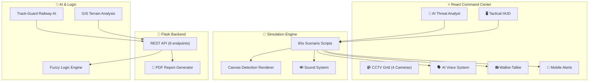

<div align="center">

# 🛡️ TRINETRA RAKSHAK

### Integrated Command & Control Surveillance System

[](https://commandcenter-seven.vercel.app)
[](https://github.com/Drishtipixiee/trinetra-rakshak-ssd)
[](https://react.dev)
[](https://vitejs.dev)
[](https://flask.palletsprojects.com)
[](LICENSE)

**A defense-grade AI surveillance system built for India's border, railway, and mining security.**  
Real-time threat detection • AI voice alerts • LLM threat intelligence • Live simulation engine

[🔴 **Live Demo**](https://commandcenter-seven.vercel.app) · [📋 **Features**](#-features) · [🚀 **Quick Start**](#-quick-start) · [🏗️ **Architecture**](#️-architecture)

</div>

---

## 📸 Overview

Trinetra Rakshak (त्रिनेत्र रक्षक — *"Three-Eyed Guardian"*) is a next-generation **Integrated Command & Control System** designed for:

- 🏔️ **Border Security** — Perimeter intrusion detection with multi-camera surveillance
- 🚂 **Railway Safety** — Track-Guard system for wildlife/obstruction detection with auto-brake
- ⛏️ **Mining Surveillance** — GIS-based terrain anomaly detection (illegal mining)
- 🔊 **AI Voice Alerts** — Text-to-speech threat briefings using Web Speech API
- 🤖 **LLM Threat Analyst** — ChatGPT-style AI intelligence with contextual analysis

> **Default Login**: `officer` / `trinetra2026`

---

## ✨ Features

### 🎯 Core Modules

| Module | Description |
|--------|-------------|
| **Live Feed** | 60-second scripted border intrusion scenario with canvas-based tactical bounding boxes |
| **CCTV Grid** | 4 cameras with independent detection scenarios (gate, perimeter, watchtower, bunker) |
| **GEO-EYE** | Satellite GIS map with terrain anomaly scanning (Jharkhand mining corridor) |
| **Track-Guard** | Railway safety with wildlife detection, auto-brake signals, time-to-impact |
| **Analytics** | Real-time charts, KPIs, and operational metrics |

### 🤖 AI Systems

| System | Technology |
|--------|-----------|
| **AI Threat Analyst** | LLM-style chatbot — ask "analyze threat", "patrol update", "recommendations" |
| **AI Voice Alerts** | Web Speech API TTS — speaks critical alerts, warnings, and all-clear |
| **Fuzzy Logic Engine** | scikit-fuzzy risk scoring based on velocity, proximity, weather |
| **Pattern Analysis** | Simulated multi-sensor fusion with threat history correlation |

### 📡 Communication

| Feature | Description |
|---------|-------------|
| **Walkie-Talkie** | Radio comms with push-to-talk, auto-transmissions on threats, radio static |
| **Mobile SMS Alerts** | Phone mockup with SMS/WhatsApp notifications on CRITICAL events |
| **AI Voice Briefings** | Automated voice alerts: *"Critical alert. 2 hostiles detected in Sector 7 Alpha..."* |

### 🔐 Security

- **SHA-256 password hashing** with salt via Web Crypto API
- **RSA-2048 key generation** during authentication
- **Session management** with sessionStorage
- Multi-role access: Officer, Commander, Admin

---

## 🚀 Quick Start

### Prerequisites
- Node.js 18+
- Python 3.10+

### Frontend (React Command Center)
```bash
cd command_center
npm install
npm run dev
```
Open [http://localhost:5173](http://localhost:5173) → Login: `officer` / `trinetra2026`

### Backend (Flask API)
```bash
cd backend
pip install -r requirements.txt
python app.py
```
API runs on `http://localhost:5000`

### Docker
```bash
docker-compose up --build
```

---

## 🏗️ Architecture



## 📁 Project Structure

```
trinetra-rakshak-ssd/
├── command_center/          # React Frontend
│   ├── src/
│   │   ├── App.jsx                  # Main app + simulation engine
│   │   ├── index.css                # 2200+ lines tactical CSS
│   │   └── components/
│   │       ├── AIThreatAnalyst.jsx   # LLM chatbot intelligence
│   │       ├── AIVoiceSystem.js      # TTS + sound effects
│   │       ├── WalkieTalkie.jsx      # Radio communications
│   │       ├── MobileAlert.jsx       # Phone SMS simulation
│   │       ├── CCTVGrid.jsx          # 4-camera surveillance
│   │       ├── AnalyticsDashboard.jsx
│   │       ├── IncidentTimeline.jsx
│   │       ├── LiveClock.jsx
│   │       ├── NightVisionToggle.jsx
│   │       ├── NotificationToast.jsx
│   │       ├── PersonnelRoster.jsx
│   │       ├── QuickActions.jsx
│   │       ├── SystemVitals.jsx
│   │       └── WeatherWidget.jsx
│   └── package.json
├── backend/
│   ├── app.py                       # Flask API (6 endpoints)
│   └── logic/
│       ├── fuzzy_engine.py
│       └── threat_predictor.py
├── docker-compose.yml
└── README.md
```

## 🛠️ Tech Stack

| Layer | Technologies |
|-------|-------------|
| **Frontend** | React 18, Vite 5, Framer Motion, Recharts, React Leaflet |
| **AI/ML** | Web Speech API (TTS), Web Crypto API, Canvas 2D |
| **Backend** | Python, Flask, Flask-CORS, scikit-fuzzy, FPDF |
| **Styling** | Custom CSS (2200+ lines), Glassmorphism, Night Vision mode |
| **Maps** | Leaflet, ESRI World Imagery tiles |
| **Deploy** | Vercel (frontend), Docker (full stack) |

## 🔗 Links

- 🔴 **Live Demo**: [commandcenter-seven.vercel.app](https://commandcenter-seven.vercel.app)
- 📦 **GitHub**: [Drishtipixiee/trinetra-rakshak-ssd](https://github.com/Drishtipixiee/trinetra-rakshak-ssd)

---

<div align="center">

**Built with ❤️ for India's defense and security infrastructure**

*Ministry of Defence — Bharat*

</div>