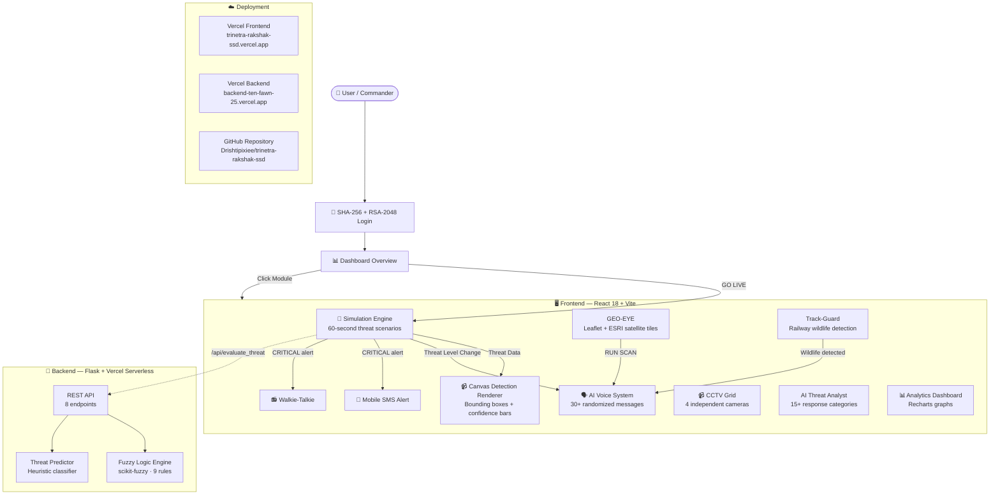

<div align="center">

# 🛡️ TRINETRA RAKSHAK

### त्रिनेत्र रक्षक — "Three-Eyed Guardian"

### AI-Powered Integrated Command & Control Surveillance System

[](https://trinetra-rakshak-ssd.vercel.app)
[](https://backend-ten-fawn-25.vercel.app/admin/db)
[](https://github.com/Drishtipixiee/trinetra-rakshak-ssd)

**A defense-grade AI surveillance prototype for India's defense infrastructure—featuring border security, railway safety, and integrated GIS mining detection.**

[🔴 **Launch Command Center**](https://trinetra-rakshak-ssd.vercel.app) · [🔐 **Open DB Viewer**](https://backend-ten-fawn-25.vercel.app/admin/db) · [📋 **Manual**](#-core-modules)


</div>

---

## What is Trinetra Rakshak?

**Trinetra Rakshak** (त्रिनेत्र रक्षक — *"Three-Eyed Guardian"*) is a real-world analogy-based prototype that demonstrates how AI can enhance India's defense infrastructure. The **3 eyes** represent:

1. 🏔️ **Border-Sentry** — AI-powered perimeter intrusion detection with fuzzy logic risk scoring
2. 🛰️ **GEO-EYE** — Satellite GIS terrain analysis for illegal mining detection in Jharkhand
3. 🚂 **Track-Guard** — Railway wildlife/obstruction detection with auto-brake signals

> Modeled after real programs: BSF's **BOLD-QIT**, Indian Railways' **Project Nilgiri**, and ISRO's **Mining Surveillance System (MSS)**.

---

## Core Modules

| Module | What it does | Real-world analogy |
|--------|-------------|-------------------|
| **Dashboard** | Command overview with status cards, module navigation, and GO LIVE button | Military situational briefing screen |
| **Telemetry** | Live real-time system health metrics (Signal, Latency, AI Confidence, Uptime) | Tactical sensor node health uplinks |
| **Live Feed** | 60-second border intrusion simulation with canvas-based tactical bounding boxes | BSF CCTV monitoring at border posts |
| **CCTV Grid** | Real perimeter video underlays with dynamic AI bounding boxes and "Wanted" profiling | Multi-camera surveillance rooms |
| **GEO-EYE** | Satellite map (React-Leaflet + ESRI) with terrain change detection scan | ISRO/NRSC Mining Surveillance System |
| **Track-Guard** | Railway wildlife detection with auto-brake and time-to-impact calculation | Project Nilgiri elephant detection |
| **Analytics** | Real-time threat charts, KPIs, and trend analysis | Military intelligence dashboards |

---

## AI Systems

| System | Technology | What it does |
|--------|-----------|-------------|
| **Fuzzy Logic Engine** | scikit-fuzzy (Python) | 9-rule risk scoring: velocity × proximity × visibility → risk score (0-100%) with XAI reasoning |
| **AI Voice Alerts** | Web Speech API | 30+ randomized voice messages — different every cycle. Speaks on WARNING, CRITICAL, ALL-CLEAR, Track-Guard, and GEO-EYE scans |
| **AI Threat Analyst** | Contextual keyword engine | LLM-style chatbot — 15+ response categories: threats, patrols, border security, railway, mining, fuzzy logic, India defense, drones, and more |
| **Sound System** | Web Audio API | Siren (sweep), Klaxon (3 beeps), Detection beep, Success chime — all generated programmatically |

---

## Communication & Alerts

| Feature | Description |
|---------|-------------|
| **Walkie-Talkie (Global)** | Radio comms with push-to-talk, auto-transmissions on CRITICAL threats (from CCTV, Track-Guard, and Geo-Eye), and authentic radio static bursts |
| **Mobile SMS** | Phone mockup with SMS/WhatsApp notifications — dynamic message templates triggered across all system modules with delivery receipts |
| **Voice Alerts** | AI speaks in Indian English — 5 variants each for CRITICAL, WARNING, ALL-CLEAR + Track-Guard + GEO-EYE |

---

## Security

- **SHA-256 password hashing** with salt via Web Crypto API
- **RSA-2048 key pair generation** during authentication
- **Session management** with sessionStorage
- Multi-role access design: Officer, Commander, Admin

---

## Sector Layout

| Sector | Location | Camera | Purpose |
|--------|---------|--------|---------|
| SEC-7 | Command HQ | — | Sector Commander's post |
| SEC-7A | Northeast perimeter | CAM-01, CAM-02 | Main gate + perimeter fence |
| SEC-7B | East side | CAM-03 | Watchtower observation |
| SEC-7C | South perimeter | CAM-04 | Bunker area |
| TRK-2 | Railway corridor | Track sensors | KM 142 wildlife monitoring |
| GEO-3 | Jharkhand mining corridor | Satellite | Illegal mining detection |

---

## Quick Start

### Prerequisites
- Node.js 18+ / Python 3.10+

### Frontend
```bash
cd command_center
npm install
npm run dev
```
Open [http://localhost:5173](http://localhost:5173) → Login: `officer` / `trinetra2026`

### Backend
```bash
cd backend
pip install -r requirements.txt
python app.py
```
- **Local API**: `http://localhost:5000`
- **Local DB Viewer**: `http://localhost:5000/admin/db`
- **Vercel DB Viewer**: `https://backend-ten-fawn-25.vercel.app/admin/db`

### Docker
```bash
docker-compose up --build
```

---

## Architecture



## Project Structure

```text
trinetra-rakshak-ssd/
├── command_center/              # React Frontend (Vercel)
│   ├── src/
│   │   ├── App.jsx              # Main: login, sim engine, all 6 tabs
│   │   ├── index.css            # Tactical CSS
│   │   └── components/
│   │       ├── AIThreatAnalyst.jsx   # LLM chatbot
│   │       ├── AIVoiceSystem.js      # TTS + sound effects
│   │       ├── CCTVGrid.jsx          # 4-camera canvas rendering
│   │       ├── WalkieTalkie.jsx      # Radio communications
│   │       ├── MobileAlert.jsx       # Phone SMS mockup
│   │       └── ...
├── backend/                     # Flask Backend (Vercel Serverless)
│   ├── api/index.py             # Serverless entry point
│   ├── logic/
│   │   ├── fuzzy_engine.py      # scikit-fuzzy logic
│   │   └── threat_predictor.py  # Heuristic classifier
├── docker-compose.yml
└── README.md
```

## Tech Stack

| Layer | Technologies | Why |
|-------|-------------|-----|
| **Frontend** | React 18, Vite 5, Framer Motion, Recharts, React Leaflet | Modern SPA framework with smooth animations |
| **AI/Voice** | Web Speech API, Web Audio API, Web Crypto API | Zero-cost, offline-capable, browser-native |
| **Backend** | Flask, scikit-fuzzy, FPDF | Lightweight API with real fuzzy logic AI |
| **Maps** | Leaflet + ESRI World Imagery | Real satellite tiles for authentic GIS |
| **Deploy** | Vercel (frontend + backend) | Free, auto-deploy, serverless Python |

## What's Real vs Simulated

| Real  | Simulated 🎭 |
|---------|--------------|
| SHA-256 + RSA-2048 cryptography | Camera feeds (Backgrounds are real video, bounding boxes simulated) |
| Fuzzy logic risk scoring (scikit-fuzzy) | Target behavior scripts |
| Web Speech/Audio API voice alerts | Tactical SMS text message drops |
| Interconnected State logic across modules | Complete threat response pipeline |
| ESRI satellite map tiles | Threat scenarios (60-second scripts) |

## Live URLs

| Service | URL |
|---------|-----|
| **Frontend Live App** | [trinetra-rakshak-ssd.vercel.app](https://trinetra-rakshak-ssd.vercel.app) |
| **Backend API** | [backend-ten-fawn-25.vercel.app](https://backend-ten-fawn-25.vercel.app) |
| **Admin DB Viewer** | [backend-ten-fawn-25.vercel.app/admin/db](https://backend-ten-fawn-25.vercel.app/admin/db) |
| **GitHub** | [Drishtipixiee/trinetra-rakshak-ssd](https://github.com/Drishtipixiee/trinetra-rakshak-ssd) |

---

<div align="center">

**Built with 💗 for India's defense and security infrastructure**

*Ministry of Defence — India*

</div>
